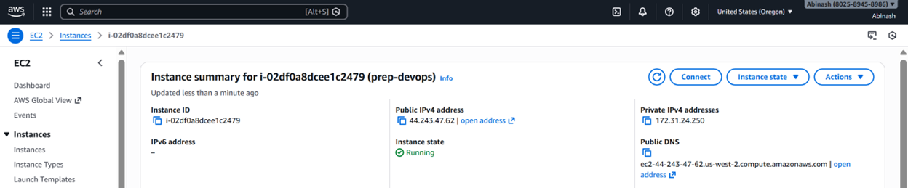
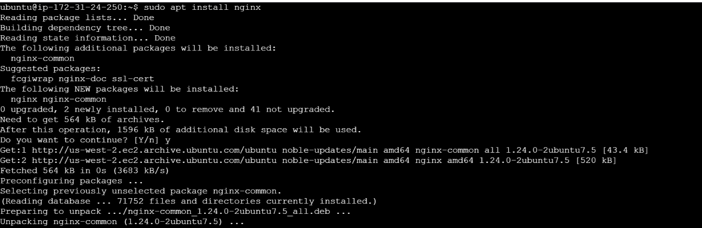
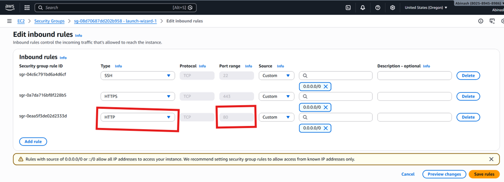
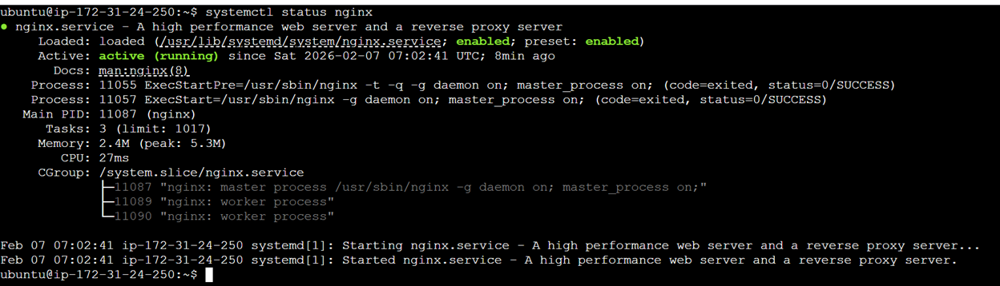
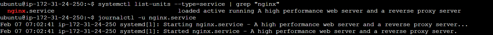
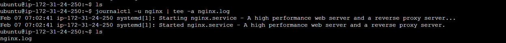
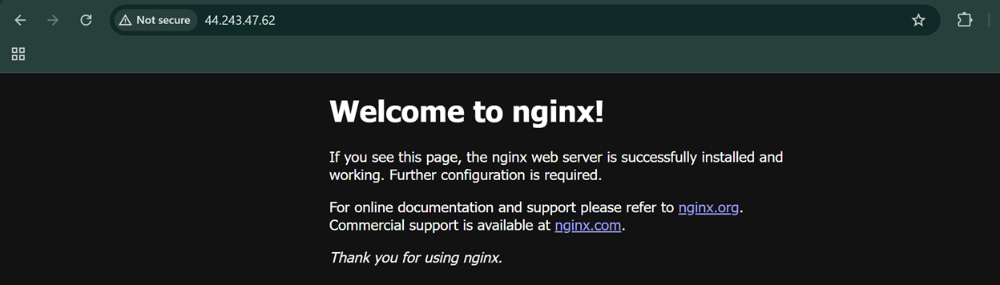

# Day 08 — Deploying a Real Web Server on the Cloud

## Goal

Deploy a **real web server on the cloud** and learn practical server management.

## Tasks

- Launch a cloud instance (AWS EC2 or Utho)
- Connect via SSH
- Install Nginx
- Configure security groups for web access (port 80)
- Extract and save logs
- Verify the webpage from the internet

## Launching the EC2 Instance

Launched an EC2 instance by visiting the AWS Console.



## Connecting via SSH

Navigate to the folder where the private key is stored and run:

```bash
ssh -i <pemkey> ubuntu@44.243.47.62
```

## Installing Nginx

Run the following commands:

```bash
sudo apt-get update
sudo apt install nginx -y
```



## Configuring Security Groups

Add inbound rule for **port 80** in the Security Group.



## Extracting Logs

Check nginx status:

```bash
systemctl status nginx
```



Extract logs to file:

```bash
journalctl -u nginx > nginx.log
```



Using **tee** to append logs:

```bash
journalctl -u nginx | tee -a nginx.log
```



## Verifying Webpage Accessibility

Open your browser and visit:

```
http://<ip_addressofec2>:80
```


