Day – 9

**Task**  
Today's goal is to **practice user and group management** by completing hands‑on challenges.  
Figure out how to:  
- Create users and set passwords  
- Create groups and assign users  
- Set up shared directories with group permissions

---

## **Task 1: Create Users**

Create three users with home directories and passwords:  
tokyo  
berlin  
professor

- To create users, we use the command:
- **useradd <user_nme>** or **adduser <user_nme>**
- 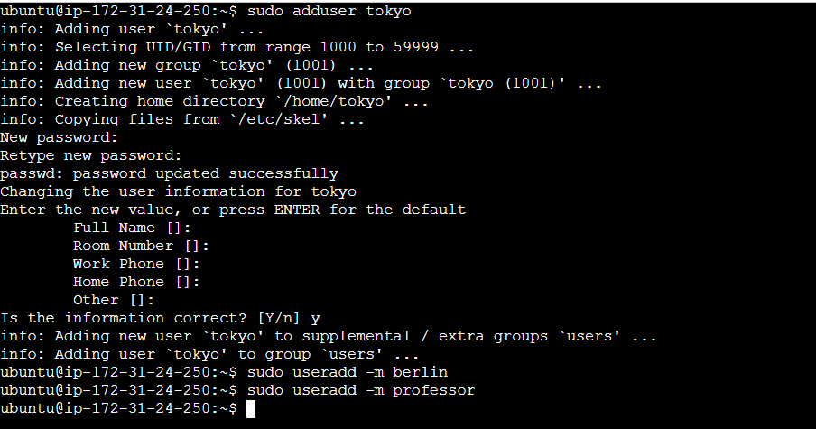
- **Adduser** would create home directory by default and ask to set password. On the other hand **useradd** would only create the user without home directory and other information. We can give **-m** flag to useradd if we want to create home directory.
- To verify that the users are created, command is:
- **sudo cat /etc/passwd**
- 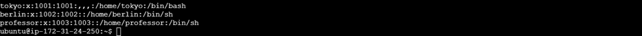
- To assign a specific shell to the user we can use the command:
- **useradd -m mumbai -s /user/bin/bash**
- or
- after creating the user, if we want to assign a specific shell to user, the command is:
- **chsh -s /user/bin/bash <user_name>**
- To verify the users created, we use the command:
- **sudo cat /etc/passwd**
- 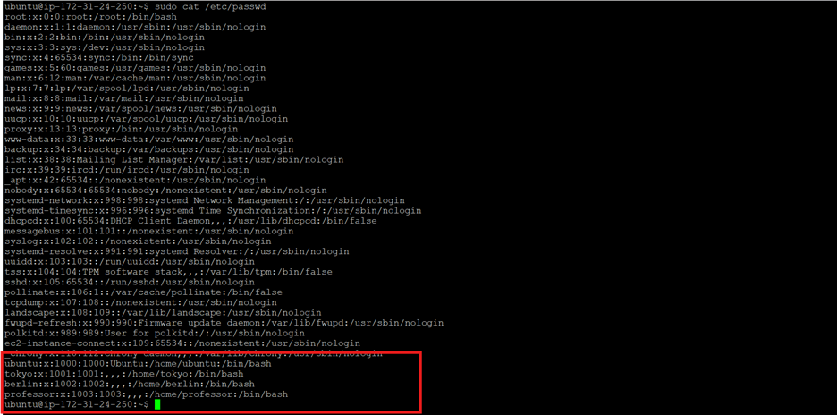
- To verify the home directory, run the command:
- **ls -l /home**
- 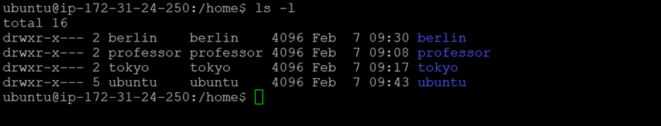
- To verify if the password is set for the users, we use the command:
- **cat /etc/shadow**
- The password will show in encrypted format. We cannot decrypt it.
- 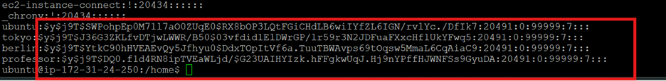

---

## **Task 2: Create Groups**

Create two groups:
- developers
- admins

**Verify:** Check /etc/group

- To create groups the command is:
- **groupadd <group_name>**
- 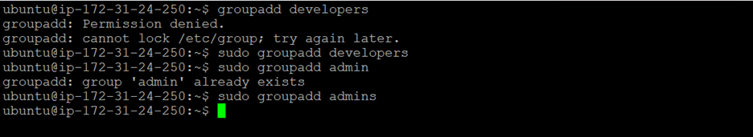
- To verify the groups created, command is:
- **cat /etc/groups** or **getent group**
- 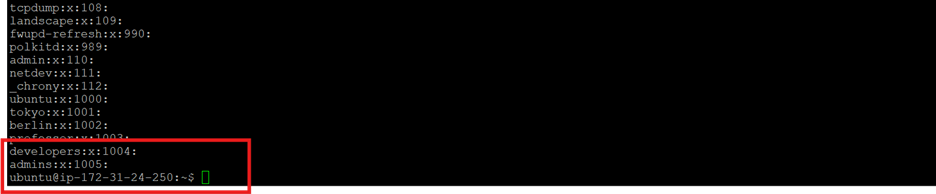

---

## **Task 3: Assign Users to Groups**

Assign users:  
tokyo → developers  
berlin → developers + admins  
professor → admins  

Verify: Use appropriate command to check group membership

- To assign users to the group, command is:
- **usermod -aG <group_name> <usr_name>**
- Add tokyo to developers:
- **usermod -aG developers tokyo**
- Add berlin to both developers and admins:
- **usermod -aG developers,admins berlin**
- Add professor to admins:
- **usermod -aG admins professor**
- To verify the group membership, command is:
- **groups tokyo**
- **groups berlin**
- **groups professor**
- 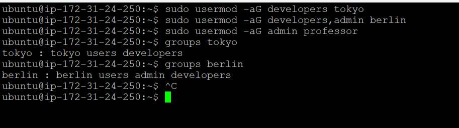

**Note:**  
We can see extra groups that are created, users and Tokyo, berlins even though we did not create and add users to them explicitly. On Ubuntu, when we create a new user with adduser, it creates a **primary group** with the same name as the user (tokyo) and adds the user to some **default secondary groups** depending on our system configuration.  
If we don’t want new users to be added to users (or other groups) we can edit `/etc/adduser.conf`  
Set: `ADD_EXTRA_GROUPS=0` or remove users from `EXTRA_GROUPS`.

---

## **Task 4: Shared Directory**

Create directory: `/opt/dev-project`  
Set group owner to developers  
Set permissions to `775`  
Test by creating files as tokyo and berlin  

**Commands:**
- **mkdir -p /opt/dev-project**
- **chown :developers /opt/dev-project**
- 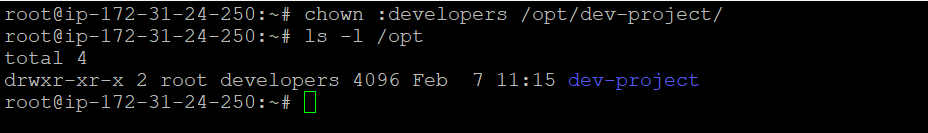
- **chmod 775 /opt/dev-project**
- 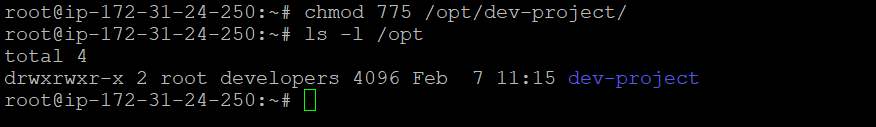
- Switch user to tokyo:  
  `sudo su - tokyo` → `touch file1.txt`
- Switch user to berlin:  
  `sudo su - berlin` → `touch file2.txt`
- 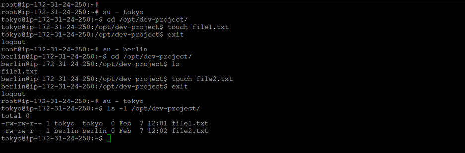

---

## **Task 5: Team Workspace**

Create user nairobi with home directory  
Create group project-team  
Add nairobi and tokyo to project-team  
Create `/opt/team-workspace` directory  
Set group to project-team, permissions to 775  
Test by creating file as nairobi

- **useradd -m nairobi -s /bin/bash**
- 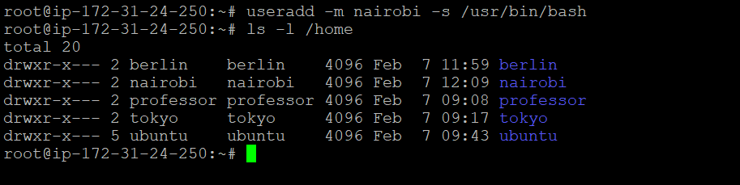
- **groupadd project-team**
- **usermod -aG project-team nairobi**
- **usermod -aG project-team tokyo**
- **mkdir -p /opt/team-workspace**
- **chown :project-team /opt/team-workspace**
- **chmod 775 /opt/team-workspace**
- 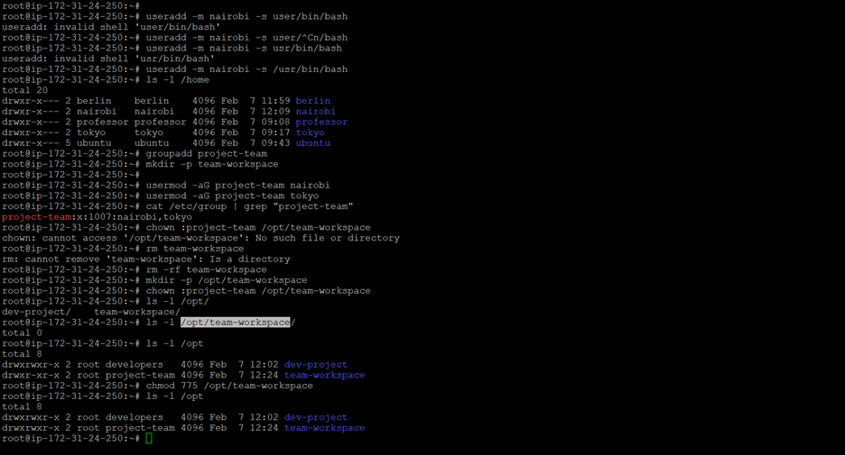
- Test by creating a file as nairobi:
- 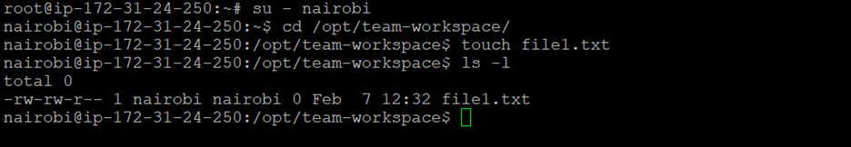

