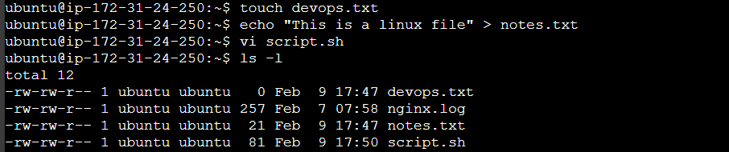
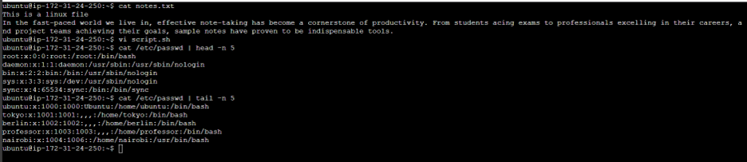
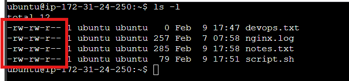
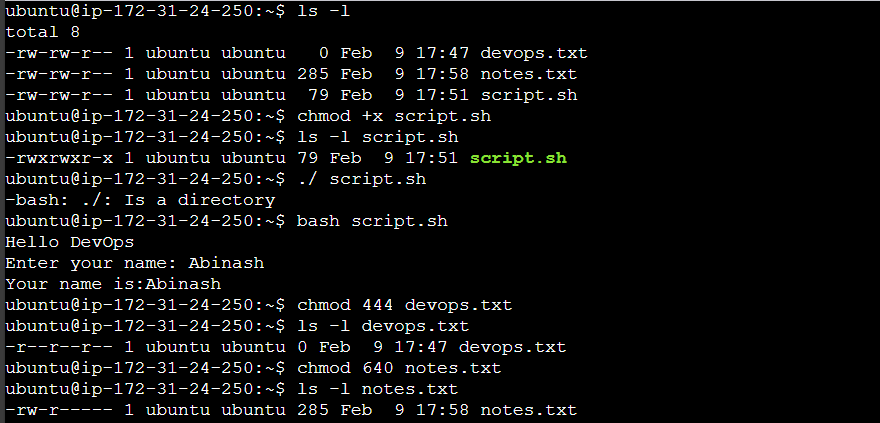
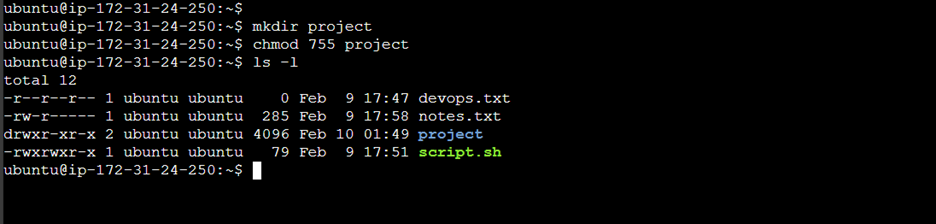
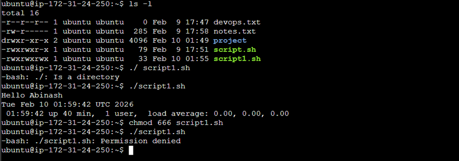

# Day – 10

## Task 1: Create Files
1. Create empty file `devops.txt` using `touch`
2. Create `notes.txt` with some content using `cat` or `echo`
3. Create `script.sh` using `vim` with content: `echo "Hello DevOps"`
4. Verify: `ls -l` to see permissions

- Created an empty `devops.txt` file using the touch command.  
  Command: `touch devops.txt`
- Created `notes.txt` file using echo.  
  Command: `echo “This is a Linux file” > notes.txt`
- Created `script.sh` using vim: `vi script.sh`
- Verified the file permissions using `ls -l`



---

## Task 2: Read Files
1. Read `notes.txt` using `cat`
2. View `script.sh` in vim read-only mode
3. Display first 5 lines of `/etc/passwd` using `head`
4. Display last 5 lines of `/etc/passwd` using `tail`

- To read the `notes.txt`, command: `cat notes.txt`
- To view the `script.sh` in vim read-only mode, command: `vi script.sh`
- To display first 5 lines of `/etc/passwd`, command: `cat /etc/passwd | head -n 5`
- To display last 5 lines of `/etc/passwd`, command: `cat /etc/passwd | tail -n 5`



---

## Task 3: Understand Permissions
Format: `rwxrwxrwx` (owner-group-others)  
- `r = read (4)`  
- `w = write (2)`  
- `x = execute (1)`

Check your files: `ls -l devops.txt notes.txt script.sh`  
What are current permissions? Who can read/write/execute?

- To check permissions of a file and directory, we have command `ls -l`.
- `r → read`, `w → write`, `x → execute`
- The current permissions which our files are:  
  - user → read, write  
  - group → read, write  
  - other → only read  



---

## Task 4: Modify Permissions
1. Make `script.sh` executable → run it with `./script.sh`
2. Set `devops.txt` to read-only (remove write for all)
3. Set `notes.txt` to `640` (owner: rw, group: r, others: none)
4. Create directory `project/` with permissions `755`

- To make the script executable, the command is: `chmod +x script.sh`
- To run the script, we can command: `bash script.sh`
- Set devops to read-only for all, the command is: `chmod 444 devops.txt`
- Set notes to `640`, command is: `chmod 640 notes.txt`
- Create a directory project with permission `755`: `chmod 755 project`

  


---

## Task 5: Test Permissions
1. Try writing to a read-only file - what happens?
2. Try executing a file without execute permission
3. Document the error messages

- Try writing to a read-only file - what happens?  
  ```bash
  ubuntu@ip-172-31-24-250:~$ echo "90days devops challenge" >> devops.txt
  -bash: devops.txt: Permission denied


  
