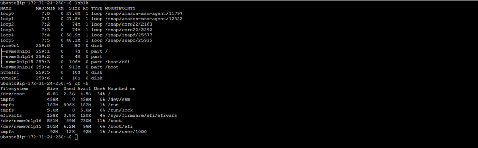
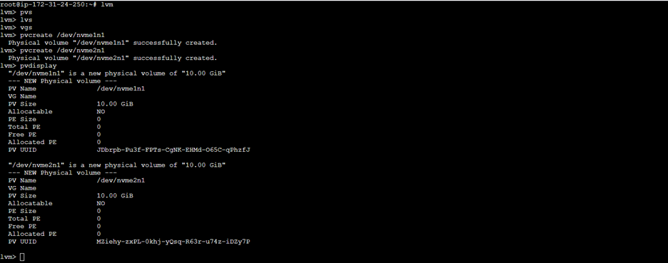
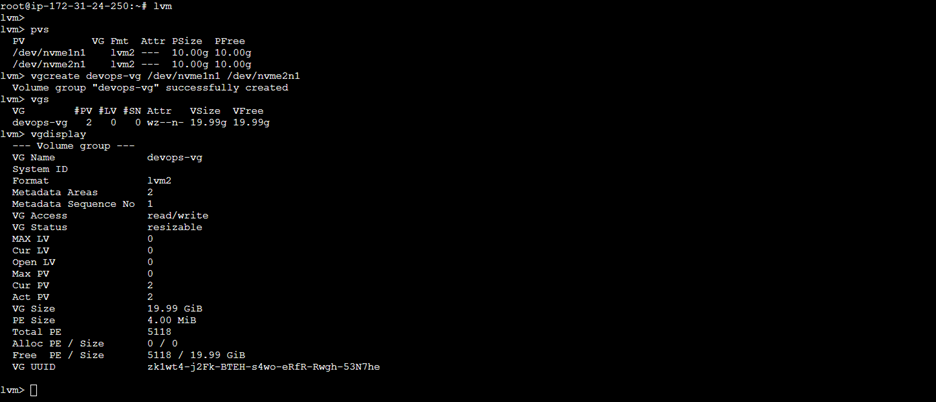
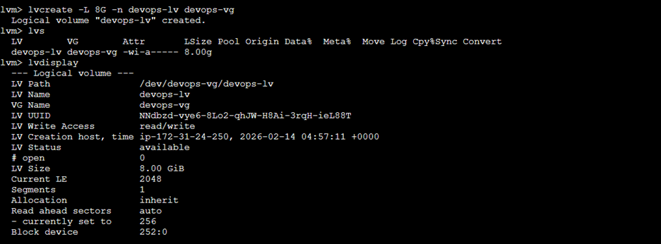
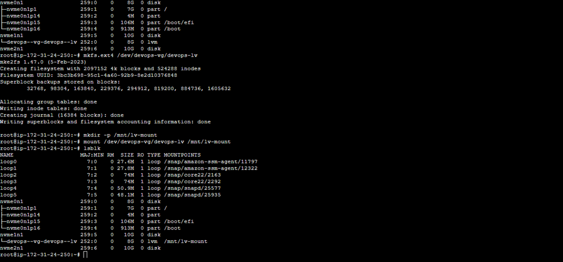
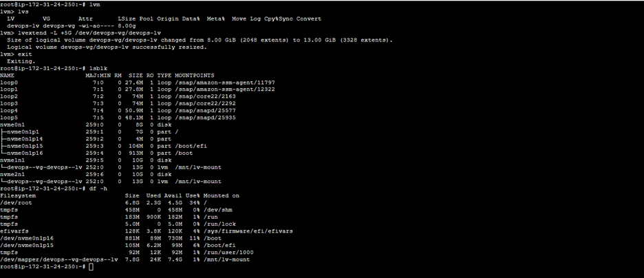

# Day 11 Challenge

### Task:1

-  Check Current Storage
  
   To check current storage, we use the command:
   ```
   lsblk
   df -h
   ```
   


### Task 2: Create Physical Volume

-  Created 3 EBBS volumes and attached to EC2 instance to demonstrate this.

-  `lvm` - This command is for navigating into the lvm comsole
-  `pvs` - This command is for checking the status of physical volume
-  `vgs` - This command is for checking the status of volume group
-  `lvs` - This command is for checking the status of logical volume
-  `pvcreate /dev/nvme1n1 /dev/nvme2n1` - This command is for creating the physical volumes from the EBS volumes that we attached.
-  `pvdisplay` - This command is to verify the physical volume created

    

### Task 3: Create Volume Group

-  `vgcreate devops-vg /dev/nvme1n1 /dev/nvme2n1` - This command is for creating volume group out of the two Physical volumes we created above.
-  `vgdisplay` - This command is to verify the volume Group created.
-  `vgs` - This command also shows the volume group status

   

### Task 4: Create Logical Volume

-  `lvcreate -L 8G -n devops-lv devops-vg` - his command is for creating logical volume from volume group. -L is for specifying logical voli=ume size and -n is for specifying logical volume name.
-  `lvs` - Check the logical volume
-  `lvdisplay` - Check the display of logical volumes

   

### Task 5: Format and Mount

-  Before we can use the logical voulumes that we creatd, we need to format it and mount it.
-  `mkfs.ext4 /dev/devops-vg/devops-lv` - This command is for formatting the local volume that we created.
-  `mount /dev/devops-vg/devops-lv /mnt/lv-mount` - This command is for mounting the volume in the path /mnt/lv-mount. It is a best practice to mount the external voulmes under the path /mnt.

      

### Task 6: Extend the Volume

-  `lvextent -L +5G /dev/devops-vg/devops-lv` - This command is for extending the logical volume by 5GB. -L is to specify the amount of volume we need to extend.
-  `lsblk` or `df -h` - Verify the extended logical volume

     


