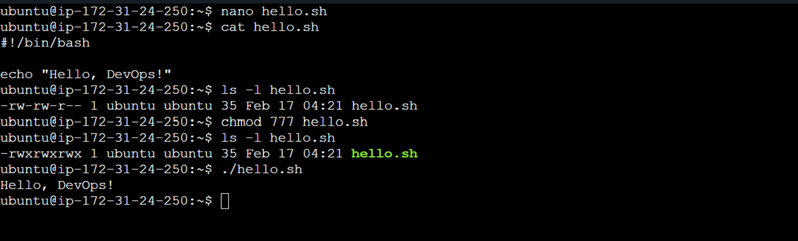
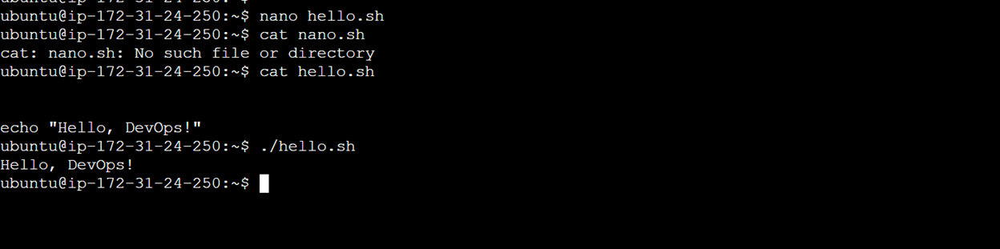
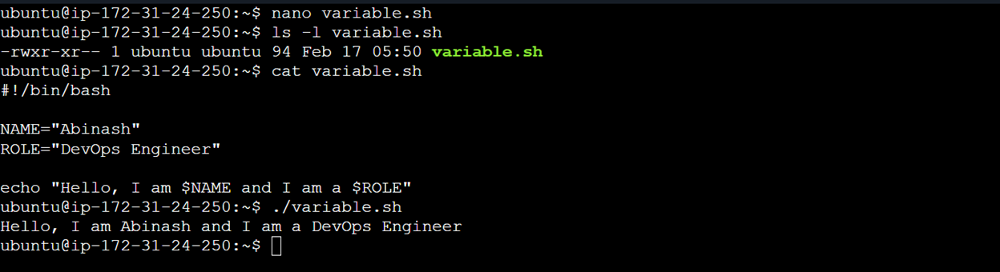
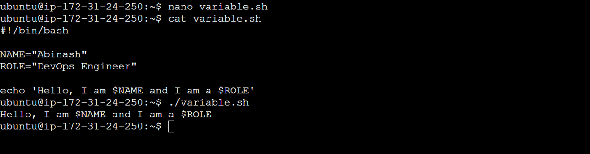
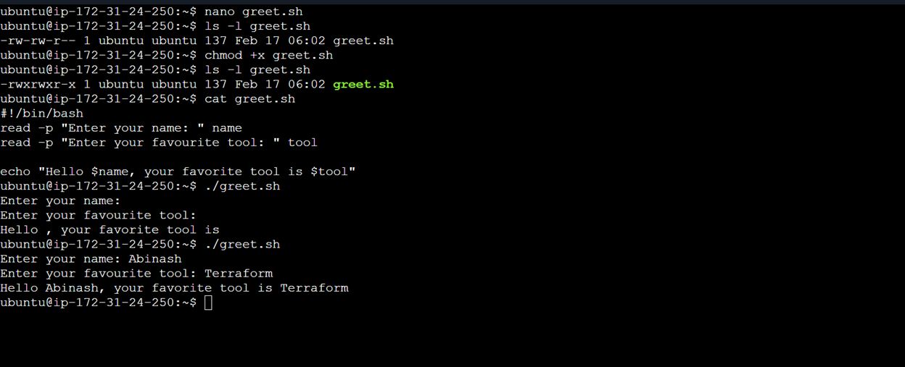
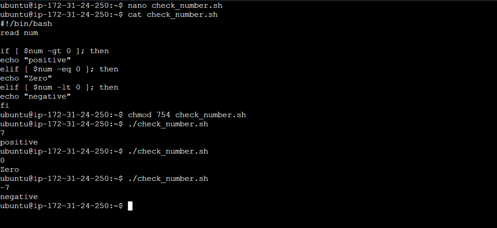
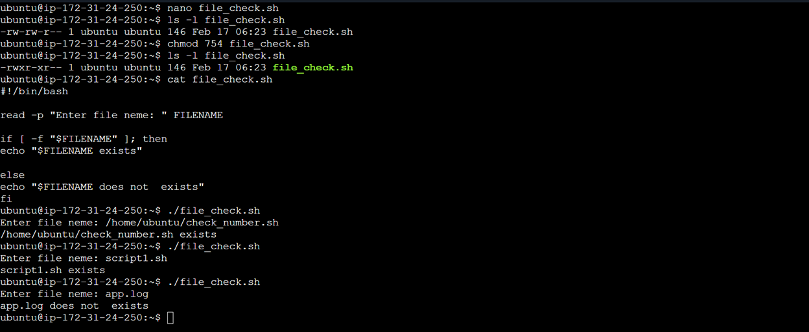
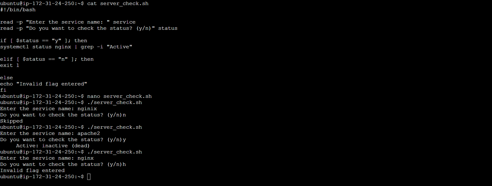

# Day 16 – Shell Scripting Basics

---

## Challenge Tasks

### Task 1

1. Create a file `hello.sh`
2. Add the shebang line `#!/bin/bash` at the top
3. Print `Hello, DevOps!` using `echo`
4. Make it executable and run it

```
touch hello.sh
```

This will create the new file hello.sh.

```
vi hello.sh

#!/bin/bash
echo 'Hello, Devops!'
```

To make it executable `chmod 754 hello.sh`
To run it `./hello.sh`



What happens if you remove the shebang line?

- Shebang tells the Operating system which interpreter should execute the file when we run it directly.
- Removing the shebang doesn't really break anything, but it changes the way our script is executed.
- Without the shebang, the script will continus to run. But incase the OS has default interpreter as 'sh' ( /bin/sh ), it may error out if we have bash‑specific features — arrays, brace      expansion, etc.
- Without shebang if we wnat to run a certain interpreter, we can invoke it explicily. Ex: instead of `./hello.sh` we can run `bash hello.sh`
- Without shebang, the portability of the script is reduced.Different systems have different default shells.
  A script that works on your machine might break on another because /bin/sh behaves differently (e.g., Dash on Ubuntu).



---

### Task 2

1. Create variables.sh with:
   - A variable for your NAME
   - A variable for your ROLE (e.g., "DevOps Engineer")
   - Print: Hello, I am <NAME> and I am a <ROLE>
2. Try using single quotes vs double quotes — what's the difference?


```
touch variable.sh
vi variable.sh
```

Script:

```
#!/bin/bash
NAME="Abinash"
ROLE="DevOps Engineer"
echo "Hello, I am $NAME and I am a $ROLE"
```


Single quotes vs Double quotes:

When we use double quotes, the variable used in the statement within the quotes 'expand'

When we use single quotes, the variables are not expanded. Everything inside is taken literally

Example:

```
#!/bin/bash
NAME="Abinash"
ROLE="DevOps Engineer"
echo 'Hello, I am $NAME and I am a $ROLE'
```

Output:

```
Hello, I am $NAME and I am a $ROLE
```



---

### Task 3

1. Create `greet.sh` that:
   - Asks the user for their name using `read`
   - Asks for their favourite tool
   - Prints: `Hello <name>, your favourite tool is <tool>`
  

```
vi greet.sh

#!/bin/bash
read -p "Enter your name: " name
read -p "Enter your favorite tool: " tool
echo "Hello $name, your favorite tool is $tool"
```



---

### Task 4: If-Else Conditions
1. Create `check_number.sh` that:
   - Takes a number using `read`
   - Prints whether it is **positive**, **negative**, or **zero**

2. Create `file_check.sh` that:
   - Asks for a filename
   - Checks if the file **exists** using `-f`
   - Prints appropriate message

```
nano check_number.sh

read num

if [ $num -gt 0 ]; then
echo "positive"
elif [ $num -eq 0 ]; then
echo "Zero"
elif [ $num -lt 0 ]; then 
echo "negative"
fi
```



```
#!/bin/bash

read -p "Enter file neme: " FILENAME

if [ -f "$FILENAME" ]; then
echo "$FILENAME exists"

else
echo "$FILENAME does not  exists"
fi
```


### Task 5:

Create `server_check.sh` that:
1. Stores a service name in a variable (e.g., `nginx`, `sshd`)
2. Asks the user: "Do you want to check the status? (y/n)"
3. If `y` — runs `systemctl status <service>` and prints whether it's **active** or **not**
4. If `n` — prints "Skipped."

```
#!/bin/bash

read -p "Enter the service name: " service
read -p "Do you want to check the status? (y/n)" status

if [ $status == "y" ]; then
systemctl status nginx | grep -i "Active"

elif [ $status == "n" ]; then
echo "Skipped"
exit 1

else
echo "Invalid flag entered"
fi
```



