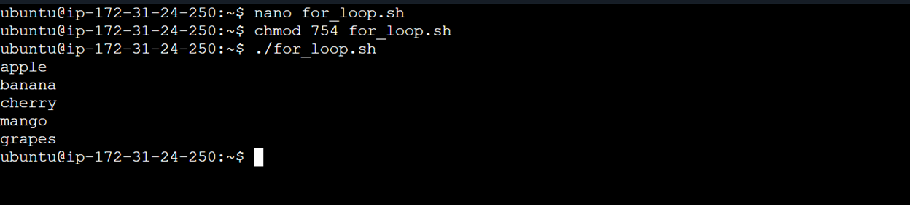
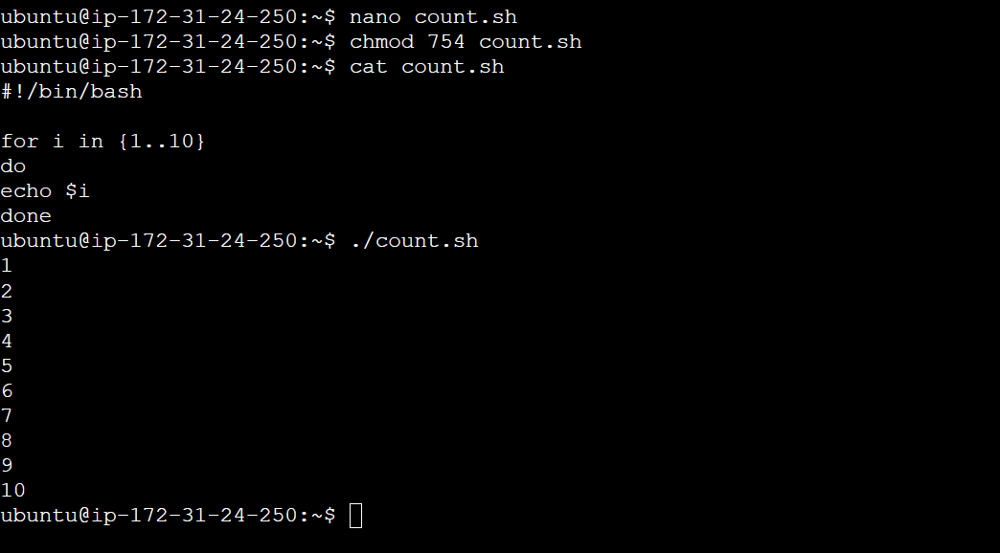
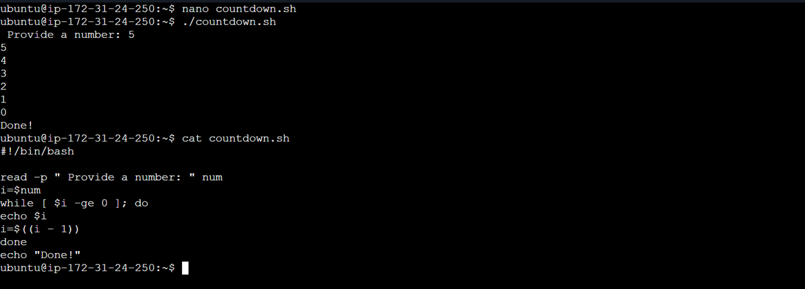
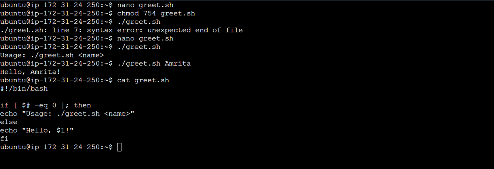
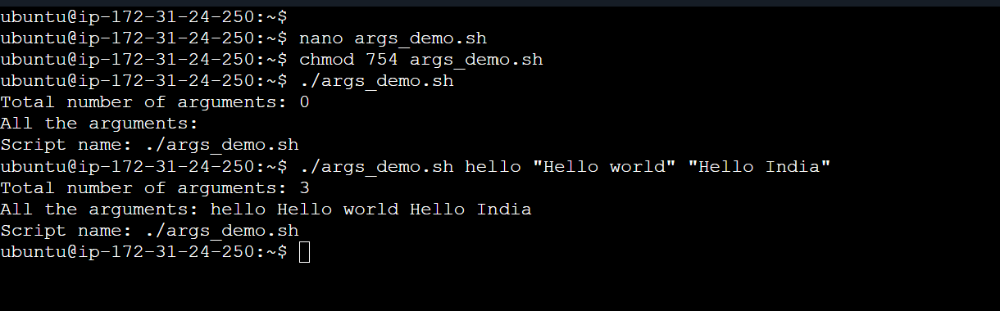
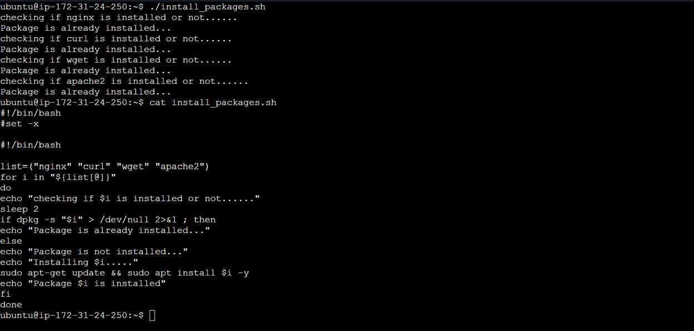
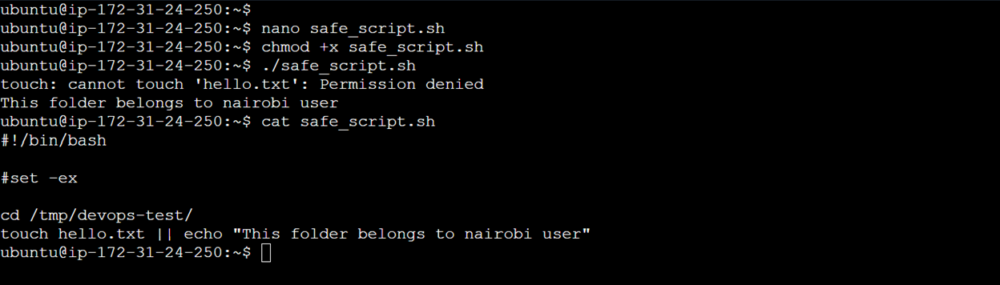

# Day 17 – Shell Scripting: Loops, Arguments & Error Handling


### Task 1: For Loop
1. Create `for_loop.sh` that:
   - Loops through a list of 5 fruits and prints each one
  
```
#!/bin/bash
for i in apple banana cherry mango grapes
do
echo $i
done
```


2. Create `count.sh` that:
   - Prints numbers 1 to 10 using a for loop

```
#!/bin/bash

for i in {1..10}
do
echo $i
done
```


---

### Task 2: While Loop
1. Create `countdown.sh` that:
   - Takes a number from the user
   - Counts down to 0 using a while loop
   - Prints "Done!" at the end

```
#!/bin/bash

read -p " Provide a number: " num
i=$num
while [ $i -ge 0 ]; do
echo $i
i=$((i - 1))
done
echo "Done!"
```



---

### Task 3: Command-Line Arguments
1. Create `greet.sh` that:
   - Accepts a name as `$1`
   - Prints `Hello, <name>!`
   - If no argument is passed, prints "Usage: ./greet.sh <name>"

```
#!/bin/bash

if [ $# -eq 0 ]; then
echo "Usage: ./greet.sh <name>"
else
echo "Hello, $1!"
fi
```



2. Create `args_demo.sh` that:
   - Prints total number of arguments (`$#`)
   - Prints all arguments (`$@`)
   - Prints the script name (`$0`)
  
```
#!/bin/bash

echo "Total number of arguments: $#"
echo "All the arguments: $@"
echo "Script name: $0"
```



---

### Task 4: Install Packages via Script
1. Create `install_packages.sh` that:
   - Defines a list of packages: `nginx`, `curl`, `wget`
   - Loops through the list
   - Checks if each package is installed (use `dpkg -s` or `rpm -q`)
   - Installs it if missing, skips if already present
   - Prints status for each package
  
```
#!/bin/bash
#set -x

#!/bin/bash

list=("nginx" "curl" "wget" "apache2")
for i in "${list[@]}"
do
echo "checking if $i is installed or not......"
sleep 2
if dpkg -s "$i" > /dev/null 2>&1 ; then
echo "Package is already installed..."
else
echo "Package is not installed..."
echo "Installing $i....."
sudo apt-get update && sudo apt install $i -y
echo "Package $i is installed"
fi
done

```



---

### Task 5: Error Handling
1. Create `safe_script.sh` that:
   - Uses `set -e` at the top (exit on error)
   - Tries to create a directory `/tmp/devops-test`
   - Tries to navigate into it
   - Creates a file inside
   - Uses `||` operator to print an error if any step fails

```
#!/bin/bash
set -e
mkdir -p /tmp/devops-test
cd /tmp/devops-test
touch file1.txt || echo "Permission denied to create file"
```



---


