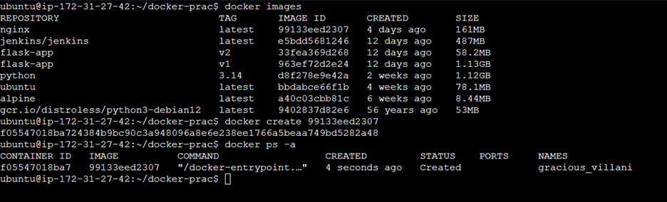
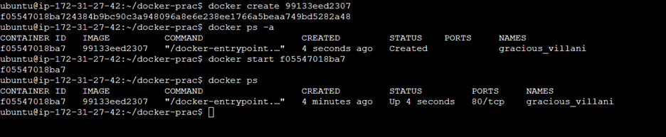
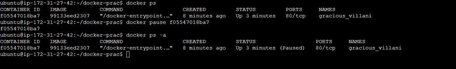
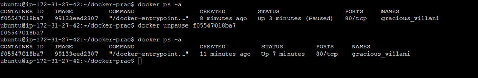
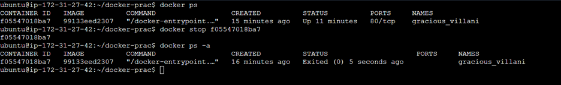
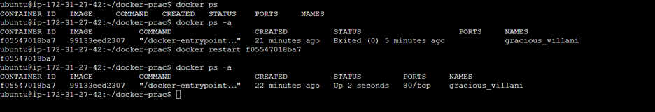
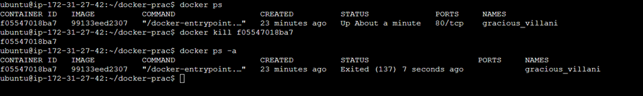
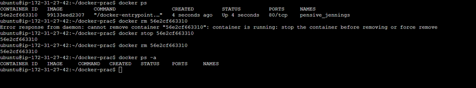

### Task 1: Docker Images
1. Pull the `nginx`, `ubuntu`, and `alpine` images from Docker Hub
   ```
   docker pull nginx
   docker pull ubuntu:latest
   docker pull alpine:latest
   ```
   
2. List all images on your machine — note the sizes
   List all the images:
   ```
   docker images
   ```
   
   
3. Compare `ubuntu` vs `alpine` — why is one much smaller?
   Comparing the images, alpine seems to be smaller
   The Alpine Docker image is much smaller than the Ubuntu image primarily because it is a minimalist Linux distribution built with size and security in mind, using lighter core components and including only the bare essentials needed to run an application. It does not have all the utilities and libraries that a general-purpose OS like Ubuntu includes by default
   
   
4. Inspect an image — what information can you see?
   To inspect an image we use the command:
   ```
   docker inspect ubuntu
   ```
   It shows all the metadata related to that image

   
   
5. Remove an image you no longer need
   To remove an image that we no longer need,command is:
   ```
   docker rmi <image-id>
   ```
   We need o stop the running containers build out this image before deleting the image.
   ```
   docker stop <container-id>
   ```

   ---

### Task 2: Image Layers
1. Run `docker image history nginx` — what do you see?
   It shows the layer-by-layer build history of the nginx image. Each line represents a layer created during the build of the image, showing:
- What command created that layer
- How big the layer is
- When it was created
- Whether the layer came from the Dockerfile or the base image
- Which layers are “squashed” or missing metadata
This is essentially a reverse‑chronological breakdown of how the image was constructed.
   
2. Each line is a **layer**. Note how some layers show sizes and some show 0B
   
   
3. Write in your notes: What are layers and why does Docker use them?
   Layers are the building blocks of every Docker image. Each instruction in a Dockerfile creates a new layer, and Docker stacks these layers to form the final image. This design makes images faster to build, smaller to store, and more efficient to share

---

### Task 3: Container Lifecycle

1. **Create** a container (without starting it)
   To create a container without starting it, command is:
   ```
   docker create <image id>
   ```
   
   
2. **Start** the container
   To start a container, the command is:
   ```
   docker start <container-id>
   ```
   

   
3. **Pause** it and check status
   To pause a container and check status, the command is:
   ```
   docker pause <container-id>
   
   ```
   


4. **Unpause** it
   To unpause a container, the command is:
   ```
   docker unpause <container-id>
   ```
   

   
5. **Stop** it
   Stopping a container means graceful shutdown.
   To stop a container, the command is:
   ```
   docker stop <container-id>
   ```
   
   
6. **Restart** it
   To restart a container, the command is:
   ```
   docker restart <container-id>
   ```
   

7. **Kill** it
   Killing a container means immidiate termination of the running container.
   To kill a container, the command is:
   ```
   docker kill <container-id>
   ```
   
   
8. **Remove** it
   Before removing a container, it must be stopped. 
   To remove a container, the command is:
   ```
   docker rm <container-id>
   ```
   
   

---


